# FISDevOps


## Overview

FISDevOps demonstrates **multi-region, multi-account incident resolution at scale** using AWS DevOps Agent. Multiple agent workspaces investigate issues across regions simultaneously, producing Root Cause Analysis (RCA) and mitigation plans.

**Why this tool exists:** To show how DevOps Agent workspaces can be orchestrated to investigate incidents across an entire organization — spanning regions and accounts — with full visibility into affected services and their dependencies.

**How it works:**
1. **Trigger investigations at scale** — AWS FIS injects real faults (pod kills, network partitions, CPU stress) into an EKS cluster. This is the easiest way to generate realistic incidents that trigger agent investigations.
2. **Agents investigate autonomously** — Multiple DevOps Agent workspaces (primary + secondary regions) receive incidents via EventBridge Global Endpoint, investigate using kubectl/CloudWatch/CloudTrail, and produce RCA.
3. **Request mitigation steps** — After investigation completes, request mitigation plans via ACP. The agent delivers actionable remediation steps.
4. **Build organization-wide dependency graph** — All incident status, affected services, resource ARNs, and cascade chains are written to Neptune graph DB, building a live dependency map across the entire organization.
5. **Self-healing path** — Mitigation steps can be fed into a code assistant tool (e.g., Amazon Q Developer) for automated remediation.


---


## Architecture Overview

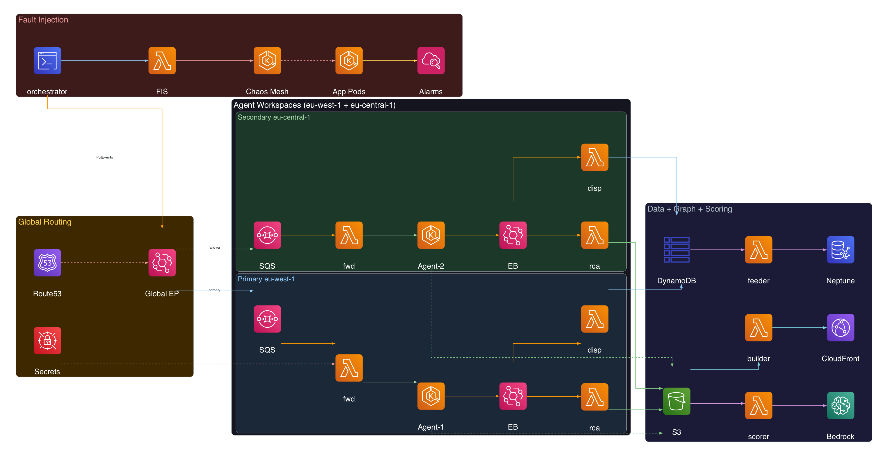

The system spans multiple AWS regions with the following core components:

| Component | Location | Purpose |
|-----------|----------|---------|
| **EKS cluster** `chaos-cluster` | us-west-2 | Hosts retail-store sample app (ui, checkout, catalog, orders, carts, assets) |
| **Chaos Mesh** | chaos-mesh namespace | CRDs for fault injection (PodChaos, NetworkChaos, StressChaos, IOChaos, HTTPChaos, DNSChaos) |
| **AWS FIS** | us-west-2 | 10 experiment templates using `aws:eks:inject-kubernetes-custom-resource` |
| **DevOps Agent spaces** | eu-west-1 (primary), eu-central-1 (secondary) | AI agent that investigates incidents and produces RCA |
| **EventBridge Global Endpoint** | `fis-chaos-global` | Single entry URL routing incidents to healthy region |
| **DynamoDB Global Table** | `fis-chaos-investigations` | Single source of truth for investigation state |
| **Neptune Serverless** | `fis-chaos-investigations` cluster | Graph DB for dependency visualization and blast radius queries |
| **S3 bucket** | `fis-chaos-results-{account_id}` | Stores RCA documents, scorecards, graph JSON |
| **CloudFront** | `https://d2psey9l8b57lu.cloudfront.net` | Serves incident graph HTML |
| **orchestrator.py** | local CLI | Runs experiments end-to-end |

### Lambda Functions (7 total)

| Function | Trigger | Purpose |
|----------|---------|---------|
| `fis-chaos-dispatcher` | SQS (agent lifecycle events) | Links task_id → incident_id, writes status to DynamoDB |
| `fis-chaos-global-forwarder` | SQS (global inbound queue) | HMAC-signs and forwards incidents to agent webhooks, load-balances across spaces |
| `fis-chaos-rca-writer` | EventBridge (Investigation/Mitigation Completed) | Fetches RCA from agent API, writes to S3, enriches DynamoDB |
| `fis-chaos-scorer` | Manual invocation | Calls Claude to judge RCA quality, writes scorecard |
| `fis-chaos-graph-builder` | EventBridge (5 min) + SQS (S3 events, 60s batch) | Builds D3.js HTML from graph/*.json + DynamoDB |
| `fis-chaos-neptune-feeder` | DynamoDB Streams | Writes vertices + edges to Neptune |
| `fis-chaos-config-sync` | EventBridge (5 min) | Syncs AWS Config resources into Neptune |

### Data Flow

```bash
1. orchestrator.py starts FIS experiment → Chaos Mesh CRD injected → EKS pod fault
2. CloudWatch Alarm fires (informational)
3. orchestrator.py → PutEvents to Global Endpoint (fis-chaos-global-inbound bus)
4. EventBridge Global Endpoint → routes to healthy region's SQS queue (Route53 health check)
5. global_forwarder Lambda → reads Secrets Manager → HMAC-signs → POST to agent webhook
6. DevOps Agent investigates (reads CW logs, kubectl, CloudTrail)
7. EventBridge fires lifecycle events: "Investigation Created/In Progress/Completed"
8. Parallel paths:
   a. SQS → dispatcher Lambda → DynamoDB (status tracking)
   b. rca_writer Lambda → S3 (RCA docs) + DynamoDB (enrichment) + S3 graph/*.json
   c. DynamoDB Stream → neptune_feeder → Neptune (graph vertices/edges)
   d. S3 graph/*.json → SQS (60s batch) → graph_builder → S3 graph/index.html → CloudFront
9. orchestrator.py polls DynamoDB → retrieves RCA → scores with Claude → writes to S3
```

---


## Prerequisites


### Tools Required

| Tool | Version | Purpose |
|------|---------|---------|
| AWS CLI | v2 | AWS API access |
| Terraform | >= 1.5 | Infrastructure deployment |
| Python | 3.11+ | Orchestrator and Lambda code |
| kubectl | latest | EKS cluster management |
| eksctl | latest | EKS cluster creation |
| Helm | 3.x | Chaos Mesh installation |

### Repositories to Clone

```bash
# Main project
git clone <this-repo> FISDevOps
cd FISDevOps

# EKS + Chaos Mesh infrastructure (required for FIS experiments)
git clone https://github.com/aws-samples/amazon-eks-chaos.git
```

### AWS Account Setup

- AWS account with permissions for: EKS, FIS, EventBridge, DynamoDB, Lambda, S3, CloudFront, Neptune, Secrets Manager, Route53, IAM
- Two AWS DevOps Agent spaces provisioned (primary in eu-west-1, secondary in eu-central-1)
- Credentials configured via `aws configure` or environment variables

---


## Installation


Deployment is handled by `install.sh` which orchestrates the full stack:

```bash
# Fresh install (creates new agent spaces)
AWS_PROFILE=<YOUR_PROFILE> \
  AWS_REGION=eu-west-1 \
  AGENT_REGION_PRIMARY=eu-west-1 \
  AGENT_REGION_SECONDARY=eu-central-1 \
  CLUSTER_NAME=chaos-cluster \
  ./install.sh

# With existing agent spaces (skips space creation)
# ⚠️ ONLY use this if spaces already exist AND their IAM roles are in the account.
# If spaces were deleted and recreated manually, use the fresh install above instead —
# it creates IAM roles needed for EKS access entries.
AWS_PROFILE=<YOUR_PROFILE> \
  AWS_REGION=eu-west-1 \
  AGENT_REGION_PRIMARY=eu-west-1 \
  AGENT_REGION_SECONDARY=eu-central-1 \
  CLUSTER_NAME=chaos-cluster \
  PRIMARY_SPACE_ID='<YOUR_PRIMARY_SPACE_ID>' \
  SECONDARY_SPACE_ID='<YOUR_SECONDARY_SPACE_ID>' \
  PRIMARY_WEBHOOK_URL='<YOUR_PRIMARY_WEBHOOK_URL>' \
  PRIMARY_WEBHOOK_SECRET='<YOUR_PRIMARY_WEBHOOK_SECRET>' \
  SECONDARY_WEBHOOK_URL='<YOUR_SECONDARY_WEBHOOK_URL>' \
  SECONDARY_WEBHOOK_SECRET='<YOUR_SECONDARY_WEBHOOK_SECRET>' \
  ./install.sh
```

### Deployment Steps

| Step | Name | What It Does |
|------|------|--------------|
| 0 | Check prerequisites | Validates aws, terraform, kubectl, helm, python3.12 |
| 1 | Clone EKS repo | Clones `aws-samples/amazon-eks-chaos` for VPC + EKS Terraform modules |
| 2 | Deploy EKS | Creates VPC, EKS cluster (chaos-cluster), 2x t3.large nodes, EBS CSI driver with IRSA |
| 3 | Install Chaos Mesh | Helm install chaos-mesh v2.7.0 with containerd runtime |
| 4 | Deploy sample app | Retail store microservices (ui, checkout, catalog, orders, carts, assets) in `app` namespace |
| 5 | Enable Container Insights | CloudWatch agent addon for pod metrics (CPU, memory, restarts) |
| 6 | Apply RBAC | FIS gets Chaos Mesh access; DevOps Agent blocked from chaos-mesh namespace |
| 7 | Agent space config | Agent space configuration |
| 8 | Create DevOps Agent spaces | Creates primary + secondary spaces (or uses provided IDs) |
| 9 | Deploy FIS Layer | Terraform apply: 10 FIS templates, alarms, S3, Lambda functions, EventBridge rules, SQS, Neptune, CloudFront. Writes webhook endpoints to Secrets Manager. |

### What Gets Created

- EKS cluster `chaos-cluster` with retail-store microservices
- Chaos Mesh v2.7.0 in `chaos-mesh` namespace
- 10 FIS experiment templates
- 5 CloudWatch alarms (pod-restart, error-rate, latency, CPU, memory)
- 7 Lambda functions with associated SQS queues and EventBridge rules
- DynamoDB Global Table `fis-chaos-investigations`
- S3 bucket `fis-chaos-results-{account_id}`
- Neptune Serverless cluster with VPC networking
- CloudFront distribution for graph visualization
- EventBridge Global Endpoint with Route53 health check
- Secrets Manager secret with webhook endpoints

### Terraform Outputs

After successful deployment, terraform returns these values:

| Output | Description |
|--------|-------------|
| `global_endpoint_url` | EventBridge Global Endpoint URL (use as `ENDPOINT_ID`) |
| `global_endpoint_id` | Endpoint ID for PutEvents (e.g., `ypodrui9gf.nec`) |
| `graph_url` | CloudFront URL for the incident graph |
| `results_bucket` | S3 bucket name for results |
| `investigations_table_name` | DynamoDB table name |
| `experiment_template_ids` | Map of experiment name → FIS template ID |
| `neptune_endpoint` | Neptune cluster writer endpoint |
| `primary_agent_events_queue_url` | SQS queue URL (primary region) |
| `secondary_agent_events_queue_url` | SQS queue URL (secondary region) |

Retrieve them anytime:
```bash
cd terraform && AWS_PROFILE=<YOUR_PROFILE> terraform output
```

### Environment Variables

After deployment, create your `.env` from the outputs:

```bash
cat > .env << EOF
export AWS_PROFILE=<YOUR_PROFILE>
export ENDPOINT_ID=$(cd terraform && terraform output -raw global_endpoint_id)
export AGENT_REGION=eu-west-1
export RESULTS_BUCKET=$(cd terraform && terraform output -raw results_bucket)
export AWS_DEFAULT_REGION=eu-west-1
EOF
```

---


## Tear Down


```bash
AWS_PROFILE=<YOUR_PROFILE> AWS_REGION=eu-west-1 \
  AGENT_REGION_PRIMARY=eu-west-1 \
  AGENT_REGION_SECONDARY=eu-central-1 \
  CLUSTER_NAME=chaos-cluster \
  ./destroy.sh
```

**What gets deleted:**
- EKS cluster + node groups + Chaos Mesh + sample app
- All Lambda functions (forwarder, dispatcher, rca_writer, graph_builder, neptune_feeder, config_sync, scorer)
- Neptune cluster + instances
- CloudFront distribution
- EventBridge Global Endpoint + Route53 health check
- DynamoDB Global Table
- SQS queues + DLQs
- IAM roles + policies
- CloudWatch alarms + log groups
- FIS experiment templates
- Secrets Manager secret
- NAT Gateway + private subnets
- DevOps Agent spaces (by tag `app=devopsagent`)

**Preserved:** S3 bucket (`fis-chaos-results-*`) is intentionally kept for RCA history.


## Running Experiments

> **Note:** The S3 bucket (`$RESULTS_BUCKET`) is created automatically by terraform during installation. You do not need to create it manually.

Before running experiments, activate the environment:

```bash
source .venv/bin/activate && source .env
```

### Run a Specific Experiment

```bash
source .venv/bin/activate && source .env
python orchestrator.py \
  --templates templates.json \
  --endpoint-id "$ENDPOINT_ID" \
  --agent-space-id "$AGENT_SPACE_ID" \
  --bucket "$RESULTS_BUCKET" \
  --experiment cpu-stress
```

### Run Random Experiments (with limit)

```bash
source .venv/bin/activate && source .env
python orchestrator.py \
  --templates templates.json \
  --endpoint-id "$ENDPOINT_ID" \
  --agent-space-id "$AGENT_SPACE_ID" \
  --bucket "$RESULTS_BUCKET" \
  --random --limit 10
```

### Run with Failover (force secondary region)

```bash
source .venv/bin/activate && source .env
python orchestrator.py \
  --templates templates.json \
  --endpoint-id "$ENDPOINT_ID" \
  --agent-space-id "$AGENT_SPACE_ID" \
  --bucket "$RESULTS_BUCKET" \
  --random --limit 2 --failover
```

The `--failover` flag sets `force_target` in the event detail, routing the incident directly to the secondary agent space (eu-central-1) bypassing the Global Endpoint's capacity routing.

### All 10 Experiments

| # | ID | Chaos Kind | Target | Ground Truth | Description |
|---|-----|-----------|--------|--------------|-------------|
| 1 | `pod-kill` | PodChaos | ui pod | `pod_failure` | Kills the UI pod |
| 2 | `container-kill` | PodChaos | checkout container | `container_failure` | Kills checkout container process |
| 3 | `network-delay` | NetworkChaos | ui (500ms latency) | `network_latency` | Adds 500ms latency with 50ms jitter |
| 4 | `network-loss` | NetworkChaos | ui (80% loss) | `network_packet_loss` | Drops 80% of packets |
| 5 | `network-partition` | NetworkChaos | ui ↔ checkout | `network_partition` | Full partition between ui and checkout |
| 6 | `cpu-stress` | StressChaos | ui pod (2 workers, 100%) | `cpu_pressure` | Burns CPU for 90s |
| 7 | `memory-stress` | StressChaos | ui pod (256MB) | `memory_pressure` | Allocates 256MB, triggers OOM |
| 8 | `io-delay` | IOChaos | catalog pod (200ms) | `io_latency` | Adds 200ms to disk I/O |
| 9 | `http-abort` | HTTPChaos | ui (503, 100%) | `http_fault` | Returns 503 for all requests |
| 10 | `dns-error` | DNSChaos | ui pod | `dns_failure` | Corrupts DNS responses |

All experiments use `aws:eks:inject-kubernetes-custom-resource` FIS action with **10-minute max duration** and **90-second fault duration**.

### All Command Options

| Flag | Description |
|------|-------------|
| `--templates FILE` | Path to templates.json (required) |
| `--endpoint-id ID` | EventBridge Global Endpoint ID |
| `--agent-space-id ID` | Primary agent space ID (for RCA fetch fallback) |
| `--bucket NAME` | S3 bucket for results (created by terraform) |
| `--random` | Run experiments in random order |
| `--limit N` | Run at most N experiments |
| `--experiment ID` | Run a specific experiment by ID |
| `--failover` | Route to secondary region (eu-central-1) |
| `--queue-url URL` | SQS queue URL (optional, only needed with `--mitigation`) |
| `--mitigation` | Poll for auto-triggered mitigations after investigation |
| `--request-mitigation TASK_ID` | Request ACP mitigation for an existing investigation |

---


## Global Endpoint Routing

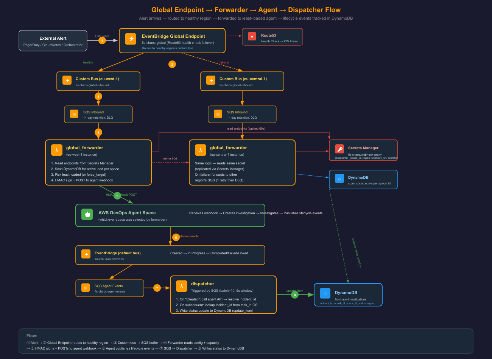

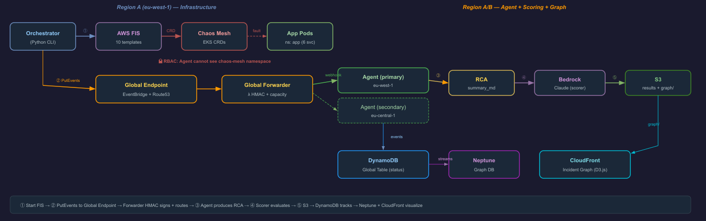


### How Incidents Are Routed

```bash
orchestrator.py → PutEvents(EndpointId) → EventBridge Global Endpoint
  → Route53 Health Check (watches CloudWatch alarm "fis-chaos-global-endpoint-health")
  → Routes to healthy region (primary: eu-west-1, secondary: eu-central-1)
  → Custom bus "fis-chaos-global-inbound" → EventBridge rule → SQS queue
  → global_forwarder Lambda
```


### Global Forwarder (`fis-chaos-global-forwarder`)

1. **Reads Secrets Manager** (`fis-chaos/webhook-proxy`) — cached 60 seconds
2. **Checks DynamoDB** for active investigation counts per space → routes to least-loaded
3. **HMAC signs** the request: `x-amzn-event-signature` = base64(HMAC-SHA256(secret, timestamp:payload))
4. **POSTs to agent webhook** URL from the endpoint configuration
5. **Records routing decision** in DynamoDB (routed_to, space_id, forwarded_at)

### Failover Behavior

- CloudWatch alarm `fis-chaos-global-endpoint-health` monitors custom metric `FISChaos/EndpointHealth`
- When alarm fires → Route53 health check fails → Global Endpoint routes to secondary region
- Each region has identical infrastructure: custom bus + SQS + forwarder Lambda
- DLQ with 14-day retention and maxReceiveCount=3
- If all endpoints fail, forwarder re-queues to other region's SQS

### `force_target` Override

Include `force_target` in the event detail to explicitly route to a specific region, bypassing the health-check-based routing. Used by `--failover` flag for testing.

---


## Dynamic Endpoint Management (Scaling)


**Current behavior:** The `global_forwarder` Lambda creates missing SQS queues on cold start and writes the `queue_url` back to the secret.

**⚠️ For 5+ workspaces:** Implement a dedicated **endpoint config monitor** Lambda triggered by Secrets Manager change events. This Lambda should:
1. Detect new endpoints without `queue_url`
2. Create SQS queue + EventBridge rule + DLQ in the target region
3. Write `queue_url` back to the secret
4. Handle endpoint removal (delete queue + rule)

This separates infrastructure provisioning from request routing.


## Dispatcher & DynamoDB

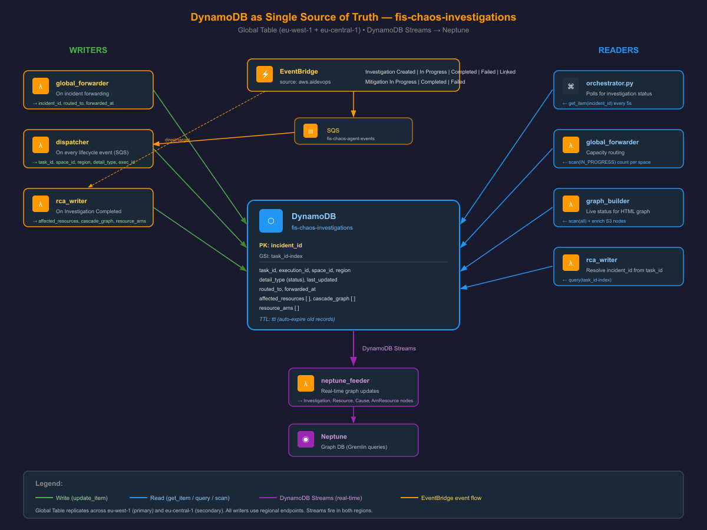


### Dispatcher (`fis-chaos-dispatcher`)

The dispatcher Lambda is triggered by SQS receiving agent lifecycle events from EventBridge. It writes status to DynamoDB on every lifecycle event:

1. **On "Investigation Created"**: Calls `list_backlog_tasks` API to get task title, extracts `incident_id` from `[incident_id]` prefix in title
2. **On subsequent events**: Looks up `incident_id` from `task_id` via GSI
3. **Writes/updates DynamoDB** keyed by `incident_id` with status, task_id, space_id, region, execution_id

### DynamoDB as Single Source of Truth

**Table:** `fis-chaos-investigations` (Global Table, replicated across primary + secondary regions)

| Property | Value |
|----------|-------|
| Hash key | `incident_id` (e.g., `fis-chaos-cpu-stress-1779338031`) |
| GSI | `task_id-index` (hash_key: `task_id`, projection: ALL) |
| Stream | NEW_AND_OLD_IMAGES (feeds Neptune Feeder) |
| TTL | `ttl` attribute (30-day retention) |
| Billing | PAY_PER_REQUEST |

### Fields Stored

| Field | Written by | Description |
|-------|-----------|-------------|
| `incident_id` | orchestrator | Unique experiment run ID |
| `task_id` | dispatcher | DevOps Agent task ID |
| `execution_id` | dispatcher | Agent execution ID |
| `space_id` | global_forwarder | Which agent space handled it |
| `region` | global_forwarder | Which region processed it |
| `status` / `detail_type` | dispatcher | Lifecycle state |
| `routed_to` | global_forwarder | Region the forwarder sent it to |
| `forwarded_at` | global_forwarder | Epoch timestamp of routing |
| `last_updated` | dispatcher | Epoch timestamp |
| `affected_resources` | rca_writer | List of resources identified in RCA |
| `cascade_graph` | rca_writer | Failure propagation chain (list of {from, to}) |
| `resource_arns` | rca_writer | Extracted ARNs + K8s paths |
| `primary_task_id` | dispatcher | For LINKED investigations |

### Who Reads/Writes

| Component | Reads | Writes |
|-----------|-------|--------|
| orchestrator | Polls by `incident_id` | Initial record |
| dispatcher | Resolves via GSI | Status updates |
| global_forwarder | Active counts per space | Routing decision |
| rca_writer | — | affected_resources, cascade_graph, resource_arns |
| neptune_feeder | DynamoDB Stream | — |
| graph_builder | Scan (last 30 days) | — |

---


## Scoring Pipeline

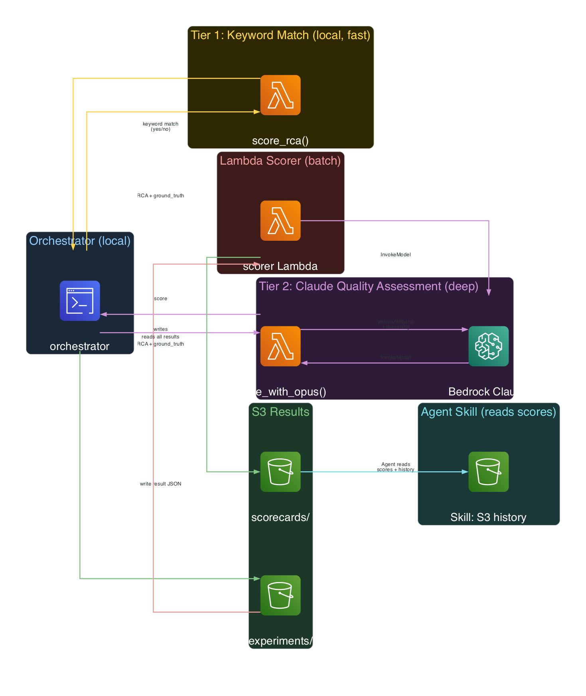


### Tier 1: Keyword Match (fast, local)

Runs locally in `orchestrator.py` — instant, no API calls:

```python
def score_rca(rca_text, ground_truth):
    gt_keywords = ground_truth.replace("_", " ").split()
    matched = any(kw in rca_lower for kw in gt_keywords)
    return {"match": matched, "snippet": ...}
```

### Tier 2: Bedrock Claude (deep, semantic)

- **Model:** `us.anthropic.claude-sonnet-4-6` (via Bedrock)
- **Scoring values:** `yes` | `partially` | `no`
- **Key distinction:** Symptom identification ≠ root cause identification
- **Runs in:** `orchestrator.py → score_with_opus()` AND `lambda/scorer.py`

**What Claude evaluates:**
- Did the agent identify the correct **ROOT CAUSE** (not just symptoms)?
- "liveness probe failed" = symptom → scores `no`
- "container was OOM-killed due to memory stress injection" = cause → scores `yes`
- If agent traced via CloudTrail/FIS API calls to the injection → scores `yes`

### Lambda Scorer (`fis-chaos-scorer`) — Batch Mode

1. Reads all `experiments/*.json` from S3
2. Calls Claude for each result
3. Writes `scorecards/latest.json` with totals (correct/partial/wrong) and per-experiment details

Output location: `s3://fis-chaos-results-{account_id}/scorecards/latest.json`

---


## Skills & S3 Knowledge Sharing

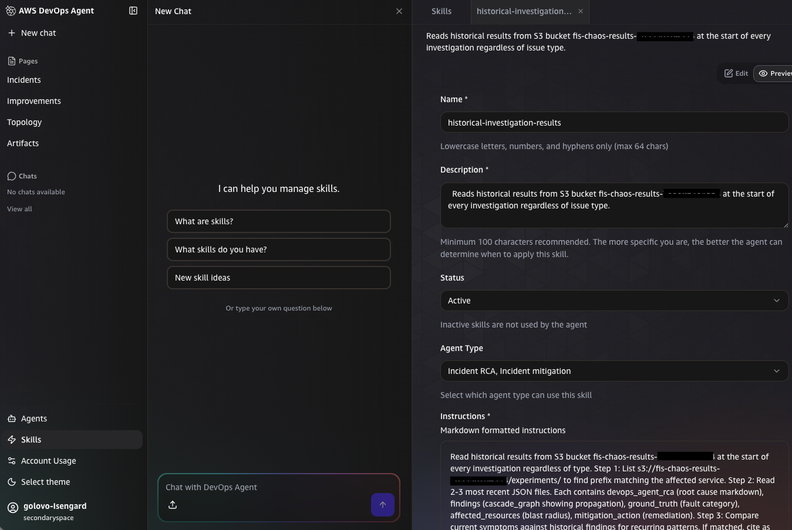

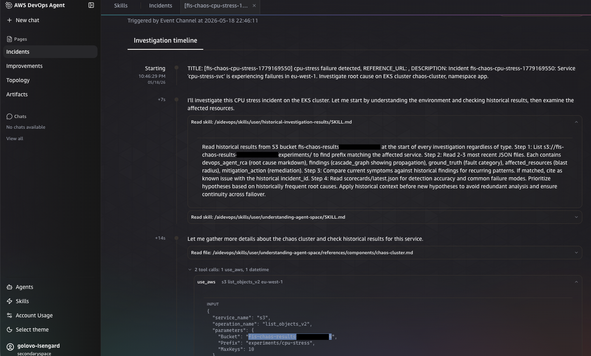

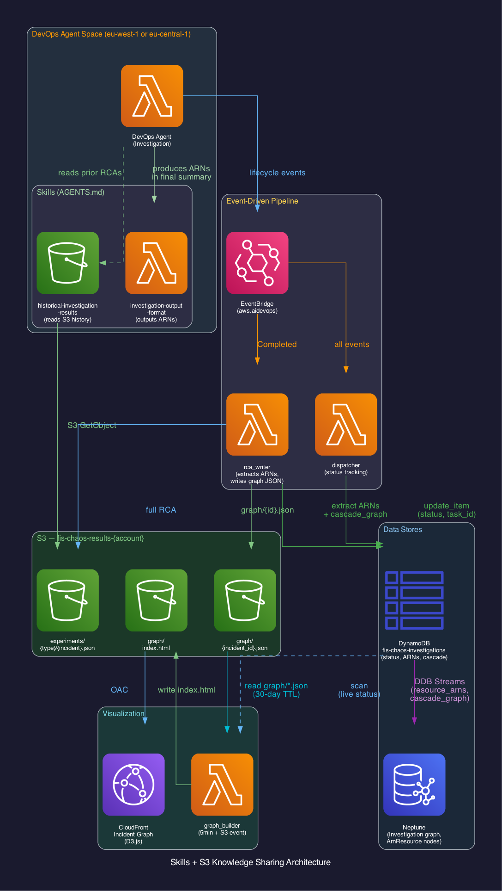


### Skill 1: `structured-resource-identifiers`

- **Type:** Agent skill configured in DevOps Agent space
- **Purpose:** Instructs agent to output a `## Affected Resource Identifiers` section at end of every investigation
- **Format:** AWS ARNs (full) + K8s paths (namespace/kind/name)
- **Used by:** `rca_writer` Lambda extracts ARNs via regex, writes to DynamoDB `resource_arns` field
- **Downstream:** Neptune feeder creates `ArnResource`/`K8sResource` vertices and cross-links to `InfraResource` via `same_as` edges

### Skill 2: S3 History Reading (historical-investigation-results)

The agent reads historical results from S3 at the start of every investigation:

1. Lists `s3://BUCKET/experiments/` to find prefix matching affected service
2. Reads 2–3 most recent JSON files (contains `devops_agent_rca`, `findings`, `ground_truth`, `affected_resources`, `mitigation_action`)
3. Compares current symptoms against historical findings for recurring patterns
4. Reads `scorecards/latest.json` for detection accuracy and common failure modes

### Feedback Loop

```bash
Investigation → RCA → S3 (experiments/) → Next Investigation reads history
                    → Scorecard → Agent reads accuracy → Adjusts approach
```

**Benefit:** Avoids redundant analysis, ensures continuity across failover, prioritizes historically frequent root causes.

---


## Neptune & AWS Config


### Neptune Feeder (`fis-chaos-neptune-feeder`)

Triggered by DynamoDB Streams (NEW_AND_OLD_IMAGES), the feeder creates graph vertices and edges in Neptune Serverless (10–16 NCU, IAM auth).

**Cluster:** `fis-chaos-investigations`

### Vertex Labels

| Label | ID Format | Source |
|-------|-----------|--------|
| `Investigation` | `inv:{incident_id}` | neptune_feeder |
| `Workspace` | `ws:{space_id}` | neptune_feeder |
| `Resource` | `res:{resource_name}` | neptune_feeder (from affected_resources) |
| `Cause` | `cause:{cause_name}` | neptune_feeder (from cascade_graph) |
| `ArnResource` | `arn:{arn}` | neptune_feeder (from resource_arns) |
| `K8sResource` | `k8s:{path}` | neptune_feeder (from resource_arns) |
| `InfraResource` | `cfg:{type}:{id}` | config_sync (from AWS Config) |

### Edge Labels

| Edge | From → To | Meaning |
|------|-----------|---------|
| `investigated_by` | Investigation → Workspace | Which space handled it |
| `affects` | Investigation → Resource | Resources impacted |
| `root_cause` | Investigation → Cause | Identified root cause |
| `cascades_to` | Cause → Resource | Failure propagation |
| `affects_resource` | Investigation → ArnResource | ARN-level impact |
| `affects_k8s` | Investigation → K8sResource | K8s resource impact |
| `linked_to` | Investigation → Investigation | Linked investigations |
| `same_as` | ArnResource → InfraResource | Cross-links ARNs to Config resources |
| `is_in` | InfraResource → InfraResource | Containment (e.g., SG → VPC) |

### Config Sync (`fis-chaos-config-sync`) — Future/Grayed Out

Runs on a 5-minute EventBridge schedule. Syncs AWS Config resources into Neptune as `InfraResource` vertices with `is_in` containment edges.

**Resource types:** EC2 (instances, VPCs, subnets, SGs), EKS clusters, RDS instances, Lambda functions, S3 buckets, SQS queues, DynamoDB tables, ALBs.

---


## Example Gremlin Queries (Neptune)

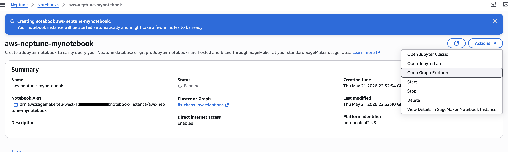

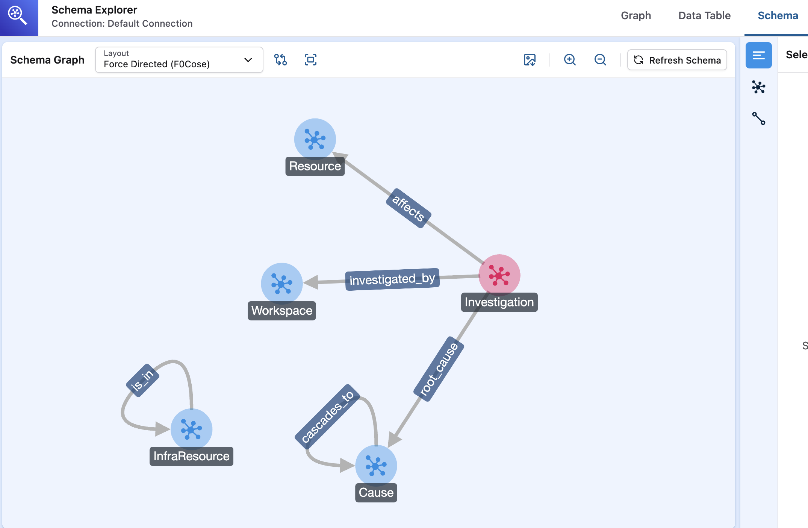


```groovy
// Find all resources affected by a specific incident
g.V('inv:fis-chaos-cpu-stress-123').out('affects').valueMap()

// Blast radius: what infrastructure is connected to affected ARNs?
g.V('inv:fis-chaos-cpu-stress-123')
  .out('affects_resource')
  .out('same_as')
  .out('is_in')
  .valueMap()

// All incidents in a workspace
g.V('ws:<YOUR_PRIMARY_SPACE_ID>').in('investigated_by').valueMap()

// Failure cascade chain
g.V('inv:fis-chaos-network-partition-456')
  .out('root_cause')
  .out('cascades_to')
  .valueMap()

// Most frequently affected resources
g.V().hasLabel('Resource')
  .project('resource', 'count')
  .by('name')
  .by(__.in('affects').count())
  .order().by('count', desc)
  .limit(10)
```


## Incident Graph Visualization

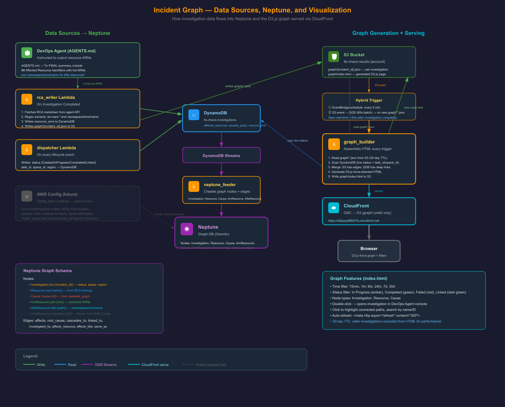

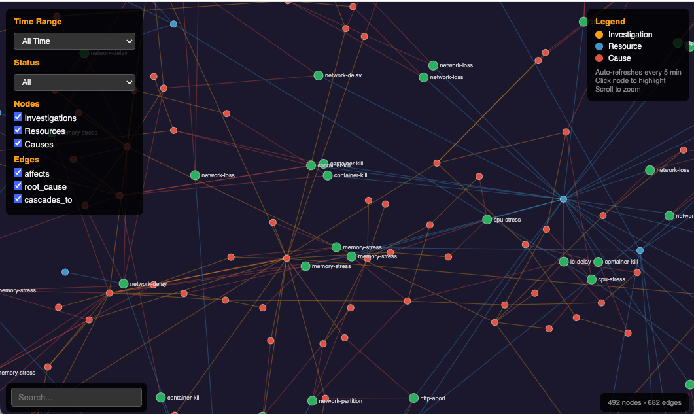


### Graph Builder (`fis-chaos-graph-builder`)

**Hybrid trigger:**
1. **Scheduled:** EventBridge rule every 5 minutes (catches DynamoDB changes)
2. **Event-driven:** SQS queue receiving S3 `ObjectCreated` events for `graph/*.json` prefix (60-second batch window for near-real-time updates)

### Data Sources Merged

| Source | Content |
|--------|---------|
| S3 `graph/*.json` | Completed investigation nodes (written by rca_writer) |
| DynamoDB scan | Live/in-progress investigations from last 30 days |

### Output

Generates `graph/index.html` — a D3.js force-directed graph written to S3 and served via CloudFront.

### Node Types & Colors

| Node Type | Color | Meaning |
|-----------|-------|---------|
| Investigation | Orange | An experiment/investigation |
| Resource | Blue | Affected resource |
| Cause | Red | Identified root cause |

### Status Colors

| Color | Status |
|-------|--------|
| Amber | In progress |
| Green | Completed |
| Red | Failed |
| Dark green | Linked |

### Interactive Features

- **Time range filter** — show investigations from last N hours/days
- **Status filter** — filter by investigation status
- **Node type toggle** — show/hide node types
- **Search** — find specific investigations or resources
- **Click** — highlight connected nodes
- **Double-click** — opens DevOps Agent console (deep link)
- **Auto-refresh** — HTML meta-refresh every 5 minutes

### Serving

- CloudFront distribution with OAC (Origin Access Control)
- Cache TTL: 0 (always fresh)
- Viewer protocol: redirect-to-https
- 30-day TTL on graph data

---


## CloudFront URL


**Live incident graph:** [https://d2psey9l8b57lu.cloudfront.net](https://d2psey9l8b57lu.cloudfront.net)

---


## ACP Mitigation


### Requesting Mitigation

After an investigation completes:

```bash
# Automatically after investigation
python3 orchestrator.py --experiment cpu-stress --mitigation

# For an existing investigation by task_id
python3 orchestrator.py --request-mitigation TASK_ID
```

### ACP Flow

1. Orchestrator calls `ACPClient.prompt_sync()`:
   `"For investigation task {task_id}, generate a mitigation plan to resolve the issue."`
2. DevOps Agent generates a mitigation plan
3. EventBridge fires `"Mitigation Completed"` event
4. `rca_writer` Lambda persists mitigation content to S3: `mitigations/{task_id}/{execution_id}.json`
5. Orchestrator polls for mitigation execution status

### Target Space/Region

Mitigation requests are routed to the same space/region that handled the original investigation (tracked in DynamoDB `space_id` and `region` fields).

### Self-Healing Path

Mitigation steps produced by the agent can be fed into a code assistant tool (e.g., Amazon Q Developer) for automated remediation:

1. Agent produces mitigation plan (stored in `s3://bucket/mitigations/{task_id}/`)
2. Code assistant reads the plan and generates infrastructure/code changes
3. Changes are submitted as a PR for review or applied automatically in non-production environments

This closes the loop: **detect → investigate → mitigate → heal** — fully automated incident resolution.

---


## ACP Client Configuration


```python
from aws_devops_agent import ACPClient

client = ACPClient(
    region="eu-west-1",  # or eu-central-1 for secondary
    space_id="<YOUR_PRIMARY_SPACE_ID>",
    user_id="<from STS get-caller-identity>"
)

# Request mitigation for a completed investigation
client.request_mitigation(task_id="44626763-9676-42cc-bdbd-9c45d2a34334")
```

## Configuration


### Secrets Manager Format

Secret name: `fis-chaos/webhook-proxy`

```json
{
  "endpoints": [
    {
      "space_id": "sp-xxxxxxxxxx",
      "region": "eu-west-1",
      "webhook_url": "https://...",
      "webhook_secret": "whsec_...",
      "queue_url": "https://sqs.eu-west-1.amazonaws.com/..."
    },
    {
      "space_id": "sp-yyyyyyyyyy",
      "region": "eu-central-1",
      "webhook_url": "https://...",
      "webhook_secret": "whsec_...",
      "queue_url": "https://sqs.eu-central-1.amazonaws.com/..."
    }
  ]
}
```

### Adding New Agent Spaces

Simply update the Secrets Manager secret with additional endpoint entries. No Lambda redeploy needed — the forwarder caches for 60 seconds then picks up changes.

### Environment Variables

| Variable | Description |
|----------|-------------|
| `AWS_REGION` | Primary infrastructure region (us-west-2) |
| `AWS_PROFILE` | AWS credentials profile |

### Terraform Variables

| Variable | Default | Description |
|----------|---------|-------------|
| `cluster_name` | `chaos-cluster` | EKS cluster name |
| `region` | `us-west-2` | Primary infrastructure region |
| `primary_agent_region` | `us-east-1` | Primary agent space region |
| `secondary_agent_region` | `us-west-2` | Secondary agent space region |
| `app_namespace` | `app` | K8s namespace for sample app |
| `chaos_mesh_namespace` | `chaos-mesh` | K8s namespace for Chaos Mesh |

---


## Troubleshooting


| Issue | Symptom | Resolution |
|-------|---------|------------|
| Expired credentials | `ExpiredTokenException` in Lambda logs | Refresh AWS credentials; check IAM role trust policies |
| Wrong space ID | Investigation never starts, forwarder logs "no matching endpoint" | Verify `space_id` in Secrets Manager matches actual DevOps Agent space |
| 403 on webhook | Forwarder logs `403 Forbidden` | Check `webhook_secret` in Secrets Manager matches agent space config; verify HMAC signing |
| SQS NonExistentQueue | `AWS.SimpleQueueService.NonExistentQueue` | Run `terraform apply` to recreate queues; check region matches |
| Graph not updating | CloudFront shows stale data | Check graph_builder Lambda logs; verify S3 event notification on `graph/` prefix; check SQS batch window |
| DynamoDB throttling | `ProvisionedThroughputExceededException` | Table uses PAY_PER_REQUEST — check for hot partition; verify incident_id uniqueness |
| Neptune connection timeout | Feeder Lambda timeout | Verify Lambda is in Neptune VPC; check security group rules allow port 8182 |
| FIS experiment fails to start | `ValidationException` from FIS | Verify EKS cluster name, RBAC roles, and Chaos Mesh CRDs are installed |
| Agent can't access cluster | Agent investigation shows no K8s data | Check `agent_access.tf` EKS access entries; verify agent role ARN |
| Route53 health check failing | All traffic routes to secondary | Check CloudWatch alarm `fis-chaos-global-endpoint-health`; verify custom metric publishing |

---


## Useful Commands


```bash
# Check investigation status in DynamoDB
AWS_PROFILE=<YOUR_PROFILE> aws dynamodb get-item \
  --table-name fis-chaos-investigations \
  --key '{"incident_id": {"S": "fis-chaos-cpu-stress-123"}}' \
  --region eu-west-1

# List recent results in S3
AWS_PROFILE=<YOUR_PROFILE> aws s3 ls s3://fis-chaos-results-<ACCOUNT_ID>/experiments/ --recursive | tail -10

# Check forwarder logs
AWS_PROFILE=<YOUR_PROFILE> aws logs filter-log-events \
  --log-group-name "/aws/lambda/fis-chaos-global-forwarder" \
  --region eu-west-1 --start-time $(date -v-10M +%s000)

# Check dispatcher logs
AWS_PROFILE=<YOUR_PROFILE> aws logs filter-log-events \
  --log-group-name "/aws/lambda/fis-chaos-dispatcher" \
  --region eu-west-1 --start-time $(date -v-10M +%s000)

# Regenerate graph manually
AWS_PROFILE=<YOUR_PROFILE> aws lambda invoke \
  --function-name fis-chaos-graph-builder \
  --region eu-west-1 /tmp/out.json && cat /tmp/out.json

# Get presigned URL for graph (alternative to CloudFront)
AWS_PROFILE=<YOUR_PROFILE> aws s3 presign \
  s3://fis-chaos-results-<ACCOUNT_ID>/graph/index.html \
  --expires-in 3600 --region eu-west-1

# Read current Secrets Manager config
AWS_PROFILE=<YOUR_PROFILE> aws secretsmanager get-secret-value \
  --secret-id "fis-chaos/webhook-proxy" --region eu-west-1 \
  --query 'SecretString' --output text | python3 -m json.tool
```


## File Index


### Terraform Files

| File | Purpose |
|------|---------|
| `main.tf` | Provider config (AWS >= 5.0), EKS data source, caller identity |
| `variables.tf` | Input variables |
| `dynamodb_dispatcher.tf` | DynamoDB global table + dispatcher Lambda (both regions) |
| `eventbridge.tf` | Primary region EventBridge rules + SQS for agent lifecycle events |
| `eventbridge_secondary.tf` | Secondary region mirror |
| `global_endpoint.tf` | Global Endpoint + forwarder Lambda (both regions) + Route53 health check + CloudWatch alarm |
| `neptune.tf` | Neptune cluster + VPC networking (NAT, private subnets) + feeder Lambda + config_sync Lambda |
| `rca_writer.tf` | RCA writer Lambda (both regions) |
| `graph_builder.tf` | Graph builder Lambda + S3 event trigger (SQS 60s batch) |
| `cloudfront_graph.tf` | CloudFront distribution + OAC + S3 bucket policy |
| `results.tf` | S3 bucket + scorer Lambda |
| `alarms.tf` | 5 CloudWatch alarms (pod-restart, error-rate, latency, CPU, memory) |
| `fis_experiments.tf` | 10 FIS experiment templates (dynamic from experiments.json) |
| `agent_access.tf` | EKS access entries for agent roles |
| `fis_iam.tf` | FIS IAM role |
| `secrets.tf` | Secrets Manager secret |

### Lambda Functions

| File | Function |
|------|----------|
| `lambda/dispatcher.py` | `fis-chaos-dispatcher` — lifecycle event processing |
| `lambda/global_forwarder.py` | `fis-chaos-global-forwarder` — HMAC signing + routing |
| `lambda/rca_writer.py` | `fis-chaos-rca-writer` — RCA persistence + enrichment |
| `lambda/scorer.py` | `fis-chaos-scorer` — batch Claude scoring |
| `lambda/graph_builder.py` | `fis-chaos-graph-builder` — D3.js HTML generation |
| `lambda/neptune_feeder.py` | `fis-chaos-neptune-feeder` — DynamoDB Stream → Neptune |
| `lambda/config_sync.py` | `fis-chaos-config-sync` — AWS Config → Neptune |

### Core Files

| File | Purpose |
|------|---------|
| `orchestrator.py` | CLI entry point — runs experiments, polls results, scores RCA |
| `install.sh` | Full-stack deployment script (EKS → Chaos Mesh → App → Terraform) |
| `experiments.json` | Defines all 10 experiment templates with ground truth |
| `AGENTS.md` | Agent skill definitions (structured-resource-identifiers, S3 history) |

### Diagrams

#### images/ (referenced in README)

| File | Description |
|------|-------------|
| `images/architecture.png` | Main architecture diagram |
| `images/scoring.png` | Scoring pipeline flow |
| `images/skills-s3-architecture_2.png` | S3 skills architecture |
| `images/dynamodb-rca-architecture.svg` | DynamoDB as single source of truth — writers/readers/schema |
| `images/dispatcher-logic.svg` | Global Endpoint → Forwarder → Agent → Dispatcher flow |
| `images/graph-dependency-flow.svg` | Data sources → Neptune → D3.js visualization pipeline |
| `images/simple_regionAB.svg` | Region A/B routing with scoring and graph builder |

#### docs/ (detailed flow diagrams)

| File | Description |
|------|-------------|
| `docs/acp-mitigation-flow.svg` | ACP mitigation request → Agent API → S3 persistence flow |
| `docs/scoring-pipeline.svg` | Two-tier scoring: keyword match + Bedrock Claude evaluation |
| `docs/investigation-pipeline-flow.svg` | Multi-alert deduplication and workspace routing |
| `docs/multi-investigation-lifecycle.svg` | Context windows, linking, and cross-region routing |

#### docs/experiments/ (experiment result charts)

| File | Description |
|------|-------------|
| `docs/experiments/token-efficiency-comparison.svg` | Token consumption: S3 Skill vs MCP Server |
| `docs/experiments/s3-accuracy-comparison.svg` | RCA accuracy with/without S3 knowledge access |
| `docs/experiments/s3-speed-accuracy-merged.svg` | Investigation duration impact of S3 skill |

#### .drawio source files

| File | Generated by | Description |
|------|-------------|-------------|
| `simple_regionAB.drawio` | diagrams.net (web) | Source for simple_regionAB.svg |
| `awsdiagram_2.drawio` | **Kiro CLI** | HA multi-region architecture |
| `skills-s3-architecture.drawio` | draw.io (Electron v29.6.1) | Original S3 skills architecture |
| `skills-s3-architecture_2.drawio` | **Kiro CLI** | Revised S3 skills architecture |
| `investigation-mitigation-overview.drawio` | diagrams.net (web) | Investigation + mitigation overview |
| `architecture_2.drawio` | **Kiro CLI** | Detailed FIS DevOps HA architecture |
| `acp-mitigation-flow.drawio` | diagrams.net (web) | Source for ACP mitigation flow |
| `scoring-pipeline.drawio` | diagrams.net (web) | Source for scoring pipeline |
| `mitigation_2.drawio` | **Kiro CLI** | ACP mitigation flow (revised) |

#### Diagram Tooling

- **SVG files**: Hand-coded XML (no Python generation libraries)
- **draw.io sources**: Created with [diagrams.net](https://diagrams.net) (web) or draw.io desktop (Electron)
- **Kiro-generated**: 4 `.drawio` files (`*_2.drawio` suffix) were generated by [Kiro CLI](https://kiro.dev) (`agent="Kiro"` in mxfile metadata)

---


## Key Design Decisions


1. **No webhook_proxy Lambda** — routing handled entirely by EventBridge Global Endpoint + global_forwarder
2. **DynamoDB as single source of truth** — all components read/write here; orchestrator polls by incident_id only
3. **Secrets Manager for dynamic endpoint config** — no Lambda redeploy needed to add/remove agent spaces
4. **Hybrid graph trigger** — scheduled (5 min) catches DDB changes; event-driven (S3 ObjectCreated) provides near-real-time updates
5. **RBAC isolation** — DevOps Agent cannot see chaos-mesh namespace, must diagnose from symptoms only
6. **30-day TTL** — DynamoDB auto-expires; S3 + Neptune retain independently for archival
7. **Multi-region deployment** — dispatcher, forwarder, rca_writer all deployed in both regions for full failover

